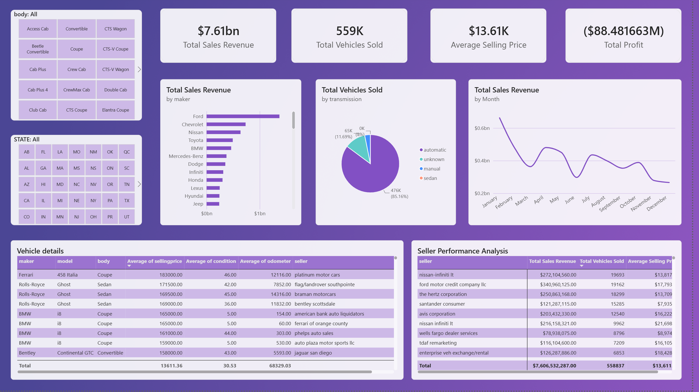
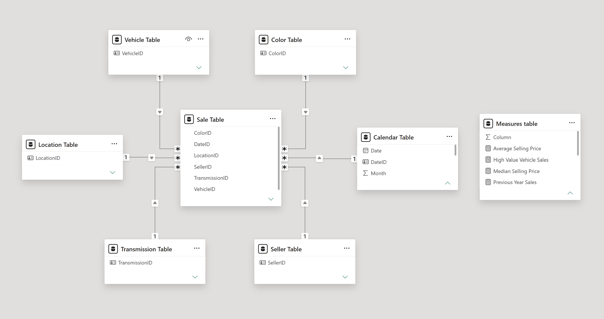

# Vehicle Sales Performance Dashboard

## Dashboard

## Overview

This project develops an interactive Power BI dashboard to analyze vehicle sales performance using a relational dataset containing vehicle, seller, location, transmission, color, calendar, and sales information.

The project focuses on data preparation, dimensional modeling, DAX calculations, and business analysis. The final dashboard provides insights into revenue, estimated profit, vehicle sales volume, manufacturer performance, transmission distribution, monthly sales trends, and seller performance.

## Business Questions

The analysis focuses on several questions:

* How much revenue is generated from vehicle sales?
* How does estimated profit compare with market reference value?
* Which manufacturers generate the highest sales revenue?
* What types of transmissions are most common among sold vehicles?
* How does sales revenue change throughout the year?
* Which sellers generate the highest revenue and sales volume?
* How do selling prices differ between high volume and high revenue sellers?

## Dataset

The dataset contains seven tables organized into a relational structure:

* FactVehicleTable
* DimVehicle
* DimTransmission
* DimSeller
* DimLocation
* DimColor
* DimCalendar

The fact table contains sales information, including condition, odometer, MMR, and selling price, as well as keys connecting the sales records to the dimension tables.

The vehicle dimension contains information about VIN, year, manufacturer, model, trim, and body type.

The remaining dimension tables contain descriptive information related to transmission, seller, location, color, and date.

## Data Preparation and ETL

The tables were inspected for missing values, duplicates, and inconsistent data types before being used in the Power BI model.

Empty strings were replaced with null values, and missing values were handled using the fill down function where appropriate.

No duplicate records or inconsistent data types were identified during the initial inspection.

One issue was identified in the transmission table. It contained one empty value and two values representing Sedan with different spellings. Because the dataset may contain transmission categories beyond the most common Automatic and Manual values, the existing categories were retained. The missing transmission value was labeled as `Unknown` so that it can be investigated and corrected if additional information becomes available.

Additional transformations included:

* Adding Start of Year, Year, Start of Month, Month, Month Name, and Week of Year to the calendar table.
* Creating a `Vehicle Profile` column by combining manufacturer, model, and body type.
* Creating a `DateID` in the calendar table to match the DateID used in the sales fact table.

## Data Model

The final model follows a **star schema**, with the Sales table at the center and the dimension tables connected to it.

The Sales table contains the foreign keys required to connect vehicle, transmission, seller, location, color, and calendar information.

Relationships were created as one to many relationships from the dimension tables to the Sales table.

This structure allows the dashboard to combine descriptive information from the dimensions with quantitative measures from the sales fact table.

## DAX Measures

Several DAX measures were created to support the dashboard analysis.

### Total Sales Revenue

Calculates the total revenue generated from vehicle sales.

### Total Vehicles Sold

Counts the total number of vehicles sold in the dataset.

### Average Selling Price

Calculates the average selling price of vehicles.

### Median Selling Price

Calculates the median selling price, providing a measure that is less affected by extreme values than the average.

### Total Profit

Calculates the total estimated profit across vehicle sales.

### High Value Vehicle Sales

Counts vehicles sold for more than $30,000.

### Vehicles with Low Condition

Counts vehicles sold with low condition ratings.

### Total Sales YTD

Calculates cumulative sales revenue from the beginning of the year through the selected date.

### Previous Year Sales

Returns total sales revenue for the corresponding period in the previous year.

### Sales Growth %

Calculates the percentage change in sales revenue compared with the previous year.

## Dashboard Insights

### Revenue and Profit

The dashboard shows total revenue exceeding $8 billion while estimated total profit is negative.

This indicates that, based on the profit calculation used in the project, selling prices were below the market reference value represented by MMR overall.

**Business implication:** Pricing decisions should consider the relationship between selling price and MMR, particularly when promotions or discounts are being evaluated.

### Sales Revenue by Manufacturer

Ford generates the highest sales revenue among the manufacturers analyzed, followed by Chevrolet, Nissan, Toyota, and BMW.

Ford's sales revenue is substantially higher than that of the second highest manufacturer.

**Business implication:** Manufacturers generating higher revenue can be considered when planning inventory allocation and marketing activity, while lower revenue brands can be examined to identify differences in demand, pricing, or sales volume.

### Transmission Distribution

Approximately 85% of vehicles sold are automatic, while manual vehicles represent approximately 3% of total vehicle sales.

Other transmission categories account for the remaining vehicles.

**Business implication:** Inventory planning can consider the observed distribution of transmission types, while less common categories may require more targeted inventory and marketing decisions.

### Monthly Sales Trend

The dashboard shows the strongest sales activity at the beginning of the year, particularly in January and February, followed by a second peak around April.

November and December show the lowest sales activity in the analyzed data.

**Business implication:** Inventory and marketing planning can be adjusted according to observed seasonal patterns. Higher activity periods may require additional preparation, while lower activity periods may create opportunities for targeted promotions.

### Seller Performance

Seller performance differs depending on whether performance is measured by total revenue or number of vehicles sold.

Ford Motor Credit Company LLC generates the highest sales revenue, followed by Nissan-Infiniti LT. Nissan-Infiniti LT sells the highest number of vehicles, followed by Ford Motor Credit Company LLC. Hertz Corporation ranks third in both measures.

The average selling price also differs between these sellers, with Ford Motor Credit Company LLC showing a higher average selling price than Nissan-Infiniti LT and Hertz Corporation.

**Business implication:** Seller performance should be evaluated using multiple measures rather than sales volume alone. Sellers with high sales volume may have opportunities to improve margins through pricing decisions, while sellers with higher average selling prices can be analyzed for differences in vehicle mix and customer demand.

## Key Takeaways

This project demonstrates the process of transforming a relational vehicle sales dataset into a Power BI analytical model and using DAX measures to support business reporting.

The analysis highlights several important patterns, including differences in manufacturer revenue, a strong concentration of automatic transmission vehicles, seasonal changes in monthly sales, and differences between seller revenue and sales volume.

A key operational finding is the negative estimated profit shown by the dashboard when selling prices are compared with MMR. This suggests that pricing and discount decisions should be evaluated carefully against market reference values.

The project also demonstrates why multiple performance measures are useful when evaluating sellers. Revenue, sales volume, and average selling price provide different perspectives on performance and can lead to different interpretations.

## Tools

* Power BI
* Power Query
* DAX
* Data modeling
* Star schema
* ETL

## Project Type

Individual academic project

## Author

Kleber Moran
